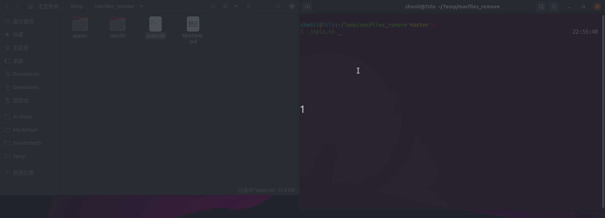

# Bash 脚本删除 Mac 生成的隐藏文件

## Demo 演示

## 文件说明

`main.sh`：bash 脚本，用于删除 Mac 生成的隐藏文件。

`testdir`：内含多级目录和 .DS_Store, Thumbs.db 随机摆放。

## 使用方法

1. clone 源码

   `git clone https://github.com/childtclx/macfiles_remove.git`

2. 授权权限

   `chmod +x main.sh`

3. 运行脚本

   `.main.sh`

4. 拖入操作目录至 Terminal 并回车继续